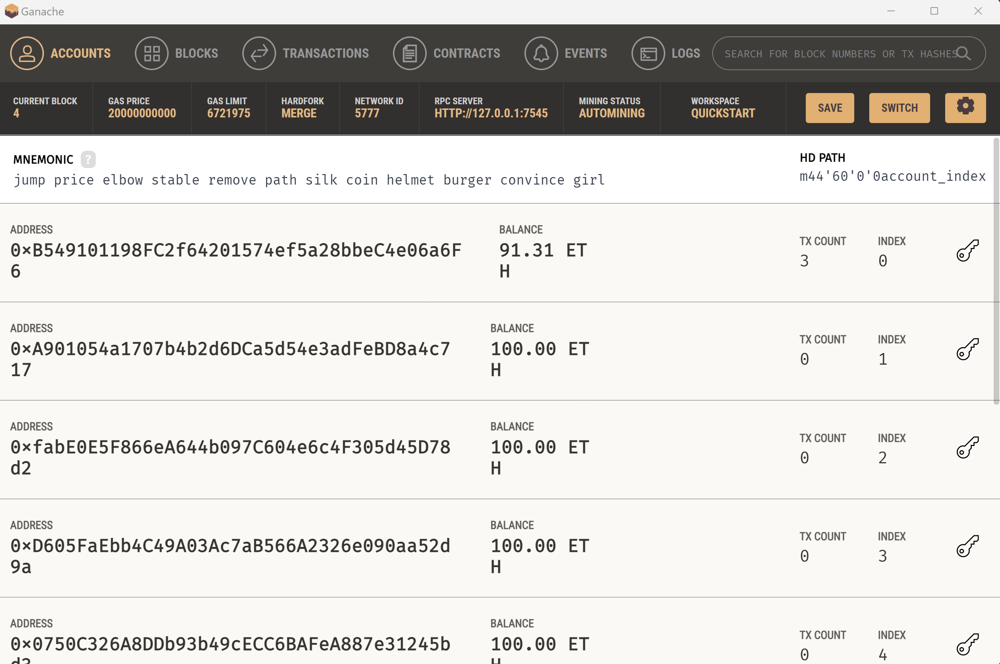
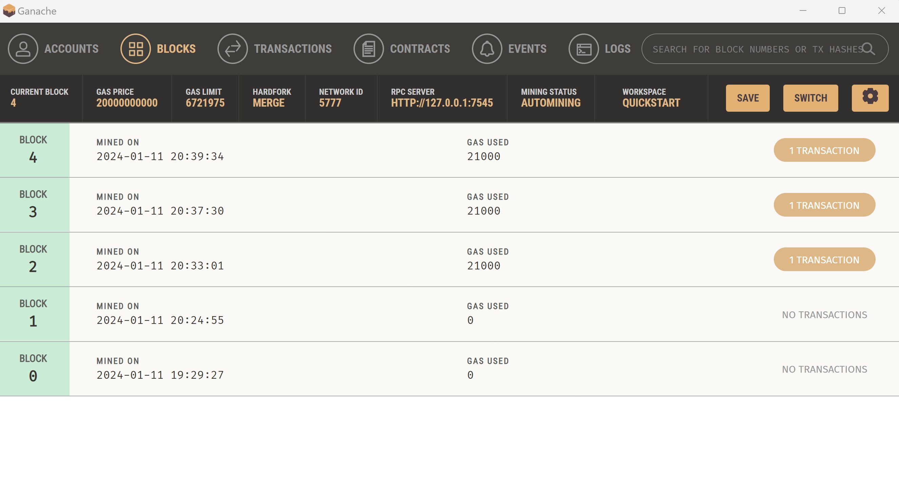
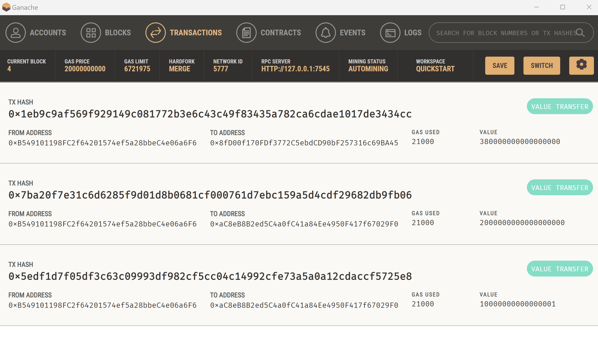

# Blockchain Wallets

## Overview
The **KryptoJobs2Go Ethereum Integration** involves the usage of two Python files: `krypto_jobs.py` (web interface) and `crypto_wallet.py` (Ethereum transaction functions). By integrating these files, we automate wallet operations, enabling users to generate an Ethereum account, check balances, calculate transaction values, sign, and send transactions.

**Note:** *This file provides a Quickstart Ethereum Demo, and the Mnemonic from Ganache is used for illustrative purposes only.*

### Step 1: Import Ethereum Transaction Functions

* Review crypto_wallet.py.

* Add Ganache-provided mnemonic to the .env file.
* In `krypto_jobs.py`, import **generate_account**, **get_balance**, and **send_transaction**.
* Create an account using generate_account in the sidebar.
* Display account balance in the sidebar using get_balance.

### Step 2: Sign and Execute a Payment Transaction

* Users select a professional and input hours in the app.

* Calculate wage: **candidate_database[person][3] * hours**
* For **Send Transaction** button - Call send_transaction with parameters: your account, candidate's address, and wage.
* Save and display transaction hash.

### Step 3: Inspect the Transaction

* Launch the app: streamlit run `krypto_jobs.py`. Select a candidate, enter hours, and click "Send Transaction."

#### Screenshots:

* Application interface

* Ganache address balance and history.

* Ganache transaction details.

* Sender's address balance and history.
